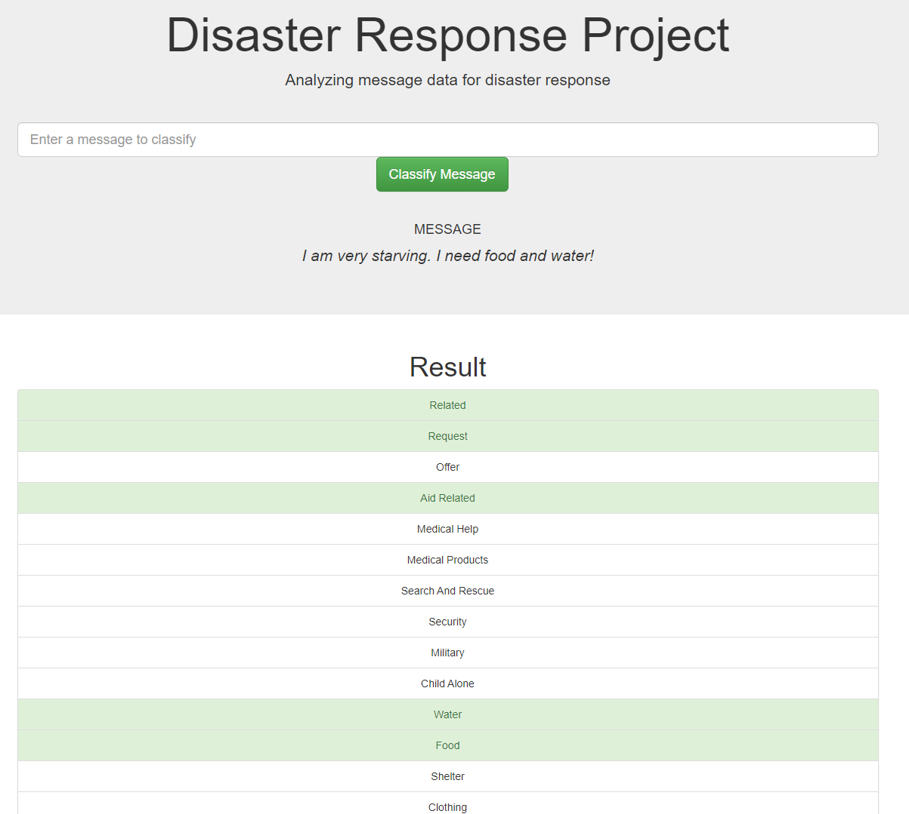

# Disaster Response Project

In this project, disaster messages derived from [Figure Eight](https://appen.com/) was analyzed, through which I therefore built a web-app which can classify messages into 36 categories with machine-learning techniques.

## Demo

For example, when I enter the disaster related message "I am very starving. I need food and water.", my ML-multi label classifier will show us the corresponding labels.




## File Descriptions

Files in this project are arranged as below.

```
├── app
│   ├── custom_transformer.py---------# MY DISASTER RELATED TRANSFORMATION
│   ├── run.py------------------------# FLASK FILE THAT RUNS APP
│   └── templates
│       ├── go.html-------------------# CLASSIFICATION RESULT PAGE OF WEB APP
│       └── master.html---------------# MAIN PAGE OF WEB APP
├── data
│   ├── DisasterResponse.db-----------# DATABASE TO SAVE CLEANED DATA TO
│   ├── disaster_categories.csv-------# DATA TO PROCESS
│   ├── disaster_messages.csv---------# DATA TO PROCESS
│   ├── dis_res_ETL_pipeline.ipynb----# ETL PROCESS DETAILED VERSION
│   └── process_data.py---------------# PERFORMS ETL PROCESS
├── models
│   ├── custom_transformer.py---------# MY DISASTER RELATED TRANSFORMATION
│   └── train_classifier.py-----------# PERFORMS CLASSIFICATION TASK
```

## Dependencies

* python
* pandas
* numpy
* sqlalchemy
* sys
* plotly
* sklearn
* joblib
* flask
* nltk

## Quick Start

The process instructions are as follows.

### Git Clone & Directory

```
git clone https://github.com/hc-psy/ds-hub.git
cd ds-hub/'Project 2 - Disaster Response Classification'
```

In the project's root directory, run the ETL pipeline that cleans and stores data in the database.

```
python data/process_data.py data/disaster_messages.csv data/disaster_categories.csv data/DisasterResponse.db
```

Then, run the ML pipeline.

```
python models/train_classifier.py data/DisasterResponse.db models/classifier.pkl
```

Last, run the flask webapp based on ML pipeline.

```
python app/run.py
```

Now, you can go to http://0.0.0.0:3001/ or http://localhost:3001/ in your web-browser.

Enter a message to input box and click on the `Classify Message` button to see the multi-labeled categories that your message falls into.


